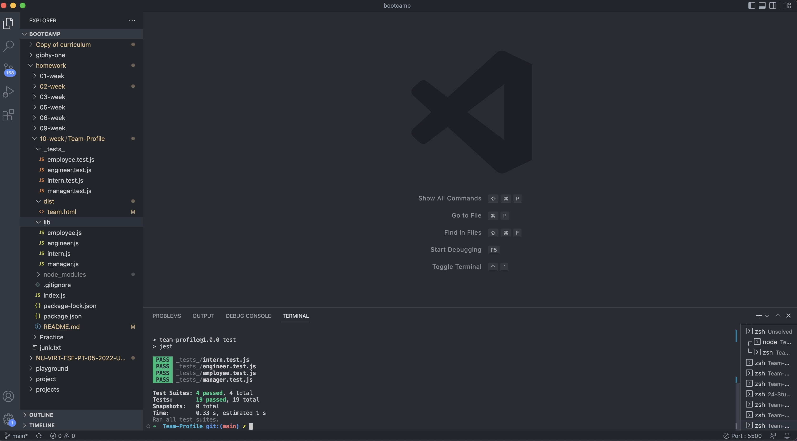

# Team-Profile

[Github URL](https://github.com/aescobar73/Team-Profile)

 

[Demo Video](https://drive.google.com/file/d/1sM2CaVpuLC5MPVRAzKtV9leuQh-4_APX/view)

 

 

## Table of Contents 

- [Installation](#installation)
- [Usage](#usage)
- [Contributions](#contributions)
- [Criteria](#Accepted-Criteria)
- [Test](#tests)
- [Question](#questions)

## Accepted Criteria
 

        GIVEN a command-line application that accepts user input
        WHEN I am prompted for my team members and their information
        THEN an HTML file is generated that displays a nicely formatted team roster based on user input
        WHEN I click on an email address in the HTML
        THEN my default email program opens and populates the TO field of the email with the address
        WHEN I click on the GitHub username
        THEN that GitHub profile opens in a new tab
        WHEN I start the application
        THEN I am prompted to enter the team manager’s name, employee ID, email address, and office number
        WHEN I enter the team manager’s name, employee ID, email address, and office number
        THEN I am presented with a menu with the option to add an engineer or an intern or to finish building my team
        WHEN I select the engineer option
        THEN I am prompted to enter the engineer’s name, ID, email, and GitHub username, and I am taken back to the menu
        WHEN I select the intern option
        THEN I am prompted to enter the intern’s name, ID, email, and school, and I am taken back to the menu
        WHEN I decide to finish building my team
        THEN I exit the application, and the HTML is generated
    

## Description

        The following Challenge requires us to generate a Team Profile that consist of:
        - Manager
        - Engineer
        - Intern

        Then after creating a profile for each member they would be added to an html file that was created using the user input.

        Classes were created so that we may run tests and make sure our functions were working correctly before being deployed.

 
 

## Contributions

The HTML page was styled with the help of [Bootstrap](https://getbootstrap.com/)

 

 

## Command Line Prompting Questions

 

 

 

## HTML Page Being Generated

 

 

 

## Test being Ran and Passing

